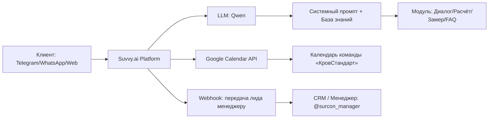
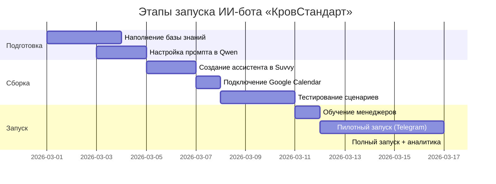

ссылка на проект @Krovstandart_bot

# 🤖 ИИ-бот-консультант компании «КровСтандарт» по подбору кровельных мембран (EPDM/TPO)

> **Документация проекта** | Версия: 1.0 | Последнее обновление: Март 2026

---

## 📋 Оглавление
1. [Обзор проекта](#-обзор-проекта)
2. [Цели и задачи](#-цели-и-задачи)
3. [Функциональные возможности](#-функциональные-возможности)
4. [Техническая архитектура](#-техническая-архитектура)
5. [База знаний](#-база-знаний)
6. [Сценарии работы](#-сценарии-работы)
7. [Интеграции](#-интеграции)
8. [Правила коммуникации](#-правила-коммуникации)
9. [Контакты и поддержка](#-контакты-и-поддержка)

---

## 👋 Обзор проекта

**ИИ-бот-консультант** — это интеллектуальный ассистент для B2B-клиентов компании «КровСтандарт», официальный партнёр Firestone. Бот помогает подобрать кровельные гидроизоляционные мембраны (EPDM/TPO/TPU), рассчитать ориентировочную смету, ответить на технические вопросы и записать клиента на бесплатный замер.

| Параметр | Значение |
|----------|----------|
| **Язык** | Русский (RU) |
| **Тон** | Экспертный, лаконичный, дружелюбный |
| **Платформа** | Suvvy.ai |
| **LLM-модель** | Qwen |
| **Целевая аудитория** | Застройщики, подрядчики, архитекторы, частные заказчики |
| **Каналы внедрения** | Telegram, WhatsApp, веб-чат |

---

## 🎯 Цели и задачи

### Бизнес-цели
```
✅ Снизить нагрузку на менеджеров на 40-60% за счёт автоматизации первичных консультаций
✅ Увеличить конверсию лидов в заявки за счёт мгновенного ответа 24/7
✅ Стандартизировать качество ответов и презентацию продуктов EPDM/TPO
✅ Собирать структурированные данные о клиентах для CRM
```

### Задачи бота
```
🔹 Осмысленно вести диалог, понимая контекст и намерения пользователя
🔹 Отвечать на вопросы по продукции, ценам, гарантии, доставке, монтажу
🔹 Помогать в подборе материала под объект (опросник из 3 вопросов)
🔹 Рассчитывать ориентировочную смету с учётом площади и комплектующих
🔹 Записывать клиента на бесплатный замер с синхронизацией в Google Calendar
🔹 Передавать «горячие» лиды менеджеру с полным контекстом диалога
```

---

## ⚙️ Функциональные возможности

### 🗣 Диалоговый движок
| Функция | Описание |
|---------|----------|
| **Понимание намерений** | Распознаёт запросы: подбор, расчёт, вопрос, замер, контакт |
| **Контекстная память** | Помнит ответы пользователя в рамках сессии (площадь, объект, регион) |
| **Мягкая обработка ошибок** | При некорректном вводе — уточняющий вопрос, а не «я не понял» |
| **Мультивариантные ответы** | Адаптирует тон и детализацию под тип клиента (частник / подрядчик / опт) |

### 📚 Работа с базой знаний
```
• Продукты: EPDM / TPO / TPU — характеристики, применение, монтаж
• Цены: ориентировочные значения с обязательным disclaimer
• Условия: мин. заказ, скидки, гарантия, доставка
• FAQ: 20+ типовых вопросов с эталонными ответами
```

### 📅 Запись на замер + Google Calendar
```
1. Бот собирает данные: адрес, тип кровли, предпочтительная дата, контакт
2. Формирует структурированную заявку
3. Передаёт данные в Google Calendar через интеграцию Suvvy
4. Отправляет клиенту подтверждение с инструкциями
5. Уведомляет менеджера о новой заявке
```

### 🔄 Эскалация на менеджера
**Автоматическая передача**, если:
- Площадь объекта >2000 м²
- Запрос точной цены на EPDM
- Упоминание: «менеджер», «договор», «оптом», «позвоните»
- Вопрос за пределами базы знаний
- Заявка на замер (все данные передаются)

---

## 🏗 Техническая архитектура



### Компоненты системы

| Компонент | Технология | Назначение |
|-----------|-----------|------------|
| **LLM-ядро** | Qwen | Генерация ответов, понимание намерений, работа с контекстом |
| **Оркестратор** | Suvvy.ai | Управление диалогом, интеграции, логика сценариев |
| **База знаний** | Встроенная в промпт | Хранение данных о продуктах, ценах, условиях, FAQ |
| **Календарь** | Google Calendar API | Запись на замер, синхронизация доступных слотов |
| **Уведомления** | Webhook / Telegram Bot API | Передача заявок менеджеру, подтверждение клиенту |

---

## 📦 База знаний (структура)

### Продукты
```markdown
### EPDM
- Срок службы: 50+ лет
- Температурный режим: до -45°C
- Монтаж: на клей, без сварки
- Применение: сложные формы, частные дома, бассейны
- Преимущества: эластичность, устойчивость к проколам

### TPO
- Срок службы: 30+ лет
- Монтаж: сварка швов горячим воздухом
- Применение: плоские кровли, промздания, склады, ТЦ
- Преимущества: УФ-стойкость, скорость монтажа, экологичность

### TPU
- Высокая износостойкость
- Стойкость к химии и маслам
- Применение: специфические промышленные объекты
```

### Цены (ориентировочно, ₽/м²)
| Продукт | Толщина | Цена | Примечание |
|---------|---------|------|------------|
| TPO | 1.14 мм | ~1 750 | Базовый вариант |
| TPO | 1.52 мм | ~2 550 | Усиленный, для промобъектов |
| ПВХ | — | от 790 | Эконом-сегмент |
| EPDM | — | по запросу | Зависит от толщины и объёма |

> ⚠️ **Важно**: Все цены сопровождаются пометкой *«Ориентировочно. Не является публичной офертой»*.

### Условия работы
```
• Минимальный заказ: 100 м²
• Скидки: 500 м² → -5%, 1000 м² → -10%
• Гарантия: до 20 лет на материал, до 10 лет на монтаж*
• Отгрузка: в день заказа при наличии на складе
• Доставка: по РФ, от 1 дня; бесплатно в ЦФО от 500 м²
*при условии монтажа сертифицированным подрядчиком
```

---

## 🔄 Сценарии работы (User Flows)

### 📊 Сценарий 1: Расчёт сметы
```
1. Бот запрашивает площадь (м²)
2. Уточняет тип объекта: 🏭 Пром / 🏢 Коммерция / 🏠 Частный
3. Предлагает выбрать материал: EPDM / TPO / «Не знаю, помогите»
4. Уточняет толщину и необходимость комплектующих
5. Рассчитывает: площадь × цена + 10-15% на допы
6. Показывает итог с disclaimer и CTA: «Отправить КП?»
```

### 🎯 Сценарий 2: Подбор материала (3 вопроса)
```
1. Объект: новое строительство / ремонт / бассейн?
2. Приоритет: срок службы / цена / скорость монтажа / климат?
3. Регион: (для учёта логистики и температур)
→ Бот рекомендует материал с обоснованием + цена-ориентир + CTA
```

### 📏 Сценарий 3: Запись на замер
```
1. Запрос адреса объекта
2. Тип кровли: плоская / скатная / не уверен
3. Предпочтительная дата: ближайшие 3 дня / неделя / своя
4. Контакт для подтверждения (Telegram/телефон)
→ Подтверждение заявки + инструкция клиенту + передача в Google Calendar
```

### ❓ Сценарий 4: FAQ / свободный диалог
```
• Бот ищет ответ в базе знаний
• Если вопрос сложный — честно говорит и предлагает связаться с менеджером
• При триггер-словах («менеджер», «договор») — мгновенная эскалация
```

---

## 🔗 Интеграции

### Google Calendar
| Параметр | Значение |
|----------|----------|
| **Метод** | OAuth 2.0 + Service Account |
| **Событие** | «Замер кровли — [Адрес]» |
| **Описание** | Контакт, тип объекта, пожелание по дате, источник (бот) |
| **Напоминание** | За 2 часа до выезда (автоуведомление клиенту) |
| **Участники** | Менеджер «КровСтандарт», клиент (опционально) |

### Webhook для передачи лидов
```json
{
  "event": "lead_escalation",
  "data": {
    "contact": "+**********",
    "name": "Иван Петров",
    "request_type": "замер | расчёт | вопрос",
    "details": "Площадь: 500 м², объект: склад, регион: МО",
    "timestamp": "2026-03-05T14:30:00Z",
    "chat_history_url": "https://suvvy.ai/chat/..."
  }
}
```

---

## 💬 Правила коммуникации

### Стиль ответов
```
✅ Лаконичность: 3-5 строк + CTA
✅ Структура: эмодзи как маркеры ✅🔹💰 (не более 2-3 на сообщение)
✅ Ясность: без жаргона, но с экспертной точностью
✅ Проактивность: всегда завершать призывом к действию
```

### Обязательные элементы
| Элемент | Когда применять |
|---------|----------------|
| `*Ориентировочно. Не оферта*` | При упоминании цен |
| `👉 CTA` | В конце каждого ответа |
| `Уточняющий вопрос` | При неоднозначном запросе |
| `Эскалация` | При триггерах (см. выше) |

### Обработка ошибок
```
❌ "Не понял ваш вопрос"
✅ "Уточните, пожалуйста: вы имеете в виду EPDM или TPO?"

❌ "Такой информации нет"
✅ "Этот вопрос требует уточнения у инженера. Хотите, чтобы менеджер связался с вами?"
```

---

## 📞 Контакты и поддержка

### Компания «КровСтандарт»
```
🏢 Адрес: г. Одинцово, ул. Агрохимиков 15А
📧 Email: roofstandart@yandex.ru
📱 Телефон: 
🌐 Сайт: 
💬 Менеджер: 
```

### Техническая поддержка бота
```
• Обновление базы знаний: через редактирование системного промпта в Suvvy
• Мониторинг диалогов: панель Suvvy.ai → Analytics → Chat Logs
• Добавление новых сценариев: через конструктор потоков Suvvy
• Интеграции: настройки в разделе «Integrations» → Google Calendar / Webhooks
```

---

## 🚀 План внедрения



---

> 📄 **Примечание**: Документ является внутренним описанием проекта. Актуальная версия промпта и настройки хранятся в рабочем пространстве Suvvy.ai компании «КровСтандарт».

*Документ подготовлен для внедрения ИИ-ассистента в каналы продаж «КровСтандарт». Все права защищены.* 🛡️
